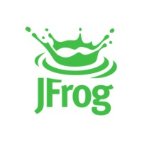

# Markdown Image Embedder

A Go application that converts markdown files by embedding referenced images as base64 data URLs. Supports both markdown and HTML image formats with automatic resizing.

## Features

- Finds all image references in markdown files using regex pattern matching
- **Supports both markdown and HTML image formats**:
  - Markdown: `{: width=X height=Y}`
  - HTML: ``
- Converts referenced images to base64 encoding
- **Automatic image resizing** based on specified dimensions
- Replaces image references with data URLs (e.g., `data:image/jpeg;base64,...`)
- **Converts HTML img tags to markdown format**
- **Supports external image URLs**: Downloads, processes, and embeds remote images
- Supports various image formats: JPEG, PNG, GIF, SVG, WebP, BMP, ICO
- Preserves original alt text for images
- Skips images that are already embedded as data URLs
- Creates a new output file with `_embedded` suffix

## Usage

```bash
# Basic usage
go run main.go <markdown-file>

# Example
go run main.go test.md
```

This will process `test.md` and create `test_embedded.md` with all images embedded as base64.

## Supported Image Formats

### Markdown Images
```markdown
# Basic markdown image


# Markdown image with size attributes
{: width=200 height=150}

# Markdown image with single dimension (maintains aspect ratio)
{: width=200}

# External image URL
{: width=300 height=200}
```

### HTML Images
```html
<!-- HTML img tag (will be converted to markdown) -->


<!-- HTML img tag without size attributes -->


<!-- HTML img tag with external URL -->

```

## Image Resizing

The application automatically resizes images based on specified dimensions:

- **Both dimensions specified**: Resizes to exact width and height
- **Single dimension specified**: Maintains aspect ratio, calculates the other dimension
- **No dimensions specified**: Keeps original size
- **High-quality scaling**: Uses bilinear interpolation for smooth resizing
- **Clean output**: Size attributes are removed from the final markdown since the image is already resized

## Example

**Input markdown:**
```markdown
# Test Markdown

## Local image with size
{: width=20 height=20}

## HTML image

```

**Output markdown:**
```markdown
# Test Markdown

## Local image with size (resized to 20x20, attributes removed)


## HTML image (converted to markdown, resized to 50x50)

```

## How it works

1. **Parses markdown content**: Uses regex to find all image references in both markdown and HTML formats
2. **Downloads external images**: For URLs, downloads images to temporary files
3. **Extracts size information**: Reads width/height attributes from markdown `{: width=X height=Y}` or HTML `width="X" height="Y"`
4. **Decodes images**: Reads and decodes image files using Go's image package
5. **Resizes images**: Applies resizing if dimensions are specified
6. **Converts to base64**: Encodes the processed image as base64
7. **Replaces references**: Substitutes original references with data URLs
8. **Converts HTML to markdown**: Transforms HTML img tags to markdown format
9. **Cleans up output**: Removes size attributes from markdown since images are already resized
10. **Cleans up temporary files**: Deletes downloaded temporary files
11. **Outputs result**: Creates a new markdown file with embedded images

## Supported Image Formats

- JPEG (.jpg, .jpeg)
- PNG (.png)
- GIF (.gif)
- SVG (.svg)
- WebP (.webp)
- BMP (.bmp)
- ICO (.ico)

## Error Handling

- If an image file cannot be found or read, the application will log a warning and continue processing other images
- If an external URL cannot be downloaded, the application will log a warning and continue processing other images
- Images that are already embedded as data URLs are skipped
- The application preserves the original markdown structure and formatting
- Temporary downloaded files are automatically cleaned up after processing

## Building

```bash
# Build the application
go build -o markdown-embedder main.go

# Run the built binary
./markdown-embedder test.md
```

## Requirements

- Go 1.21 or later
- Dependencies:
  - `golang.org/x/image/draw` (for image resizing)
  - Standard library packages (image, encoding/base64, etc.)

## Installation

```bash
# Clone or download the project
cd markdown-images

# Install dependencies
go mod tidy

# Build the application
go build -o markdown-embedder main.go
``` 