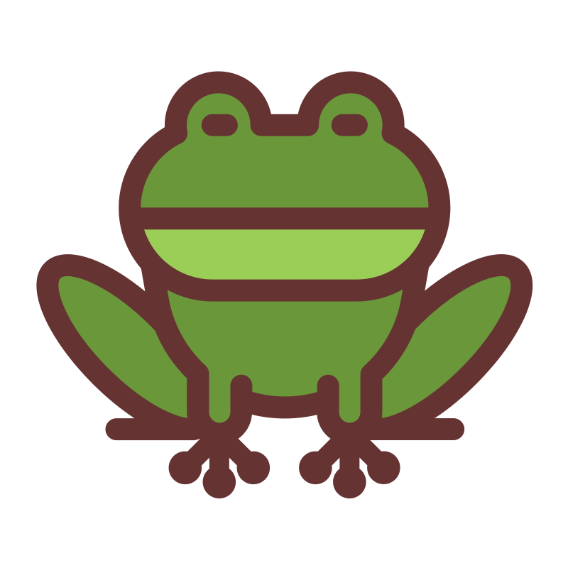

# Test Markdown

## Local image 

{: width=20 height=20}

## External png image

{: width=50 height=50}

# Huge file

## Internal svg image

{: width=150  }

## External svg image

{: height=50  }

## html format

